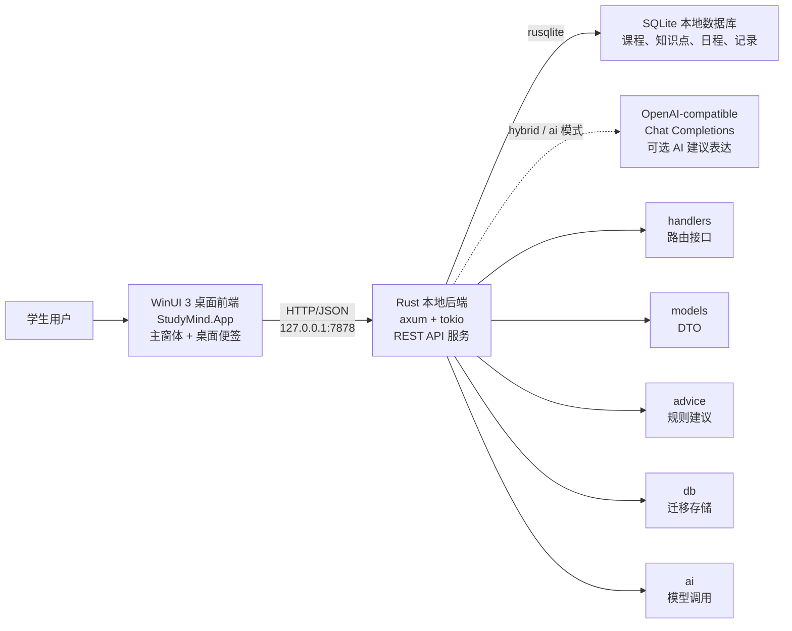
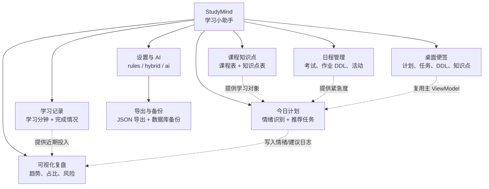

# StudyMind 项目扩展介绍

本文根据课程设计报告中的“项目背景与定位”“项目核心功能”“典型使用流程”整理，用于从整体视角介绍 StudyMind 的目标、模块和使用闭环。

## 项目背景与定位

StudyMind 是一个面向大学生学习场景的本地学习小助手。它把课程管理、知识点维护、考试或作业日程、学习记录、情绪识别、智能建议、可视化复盘和桌面便签整合到同一个桌面应用中。

与普通待办事项工具相比，StudyMind 的重点不只是记录任务，而是结合学生当前学习状态、知识点掌握情况、临近考试或 DDL、近期学习投入等信息，生成更贴合当天状态的学习安排。桌面便签小窗则用于在学习过程中提供轻量提醒，让计划不只停留在主界面里。

系统采用本地优先的前后端分离架构：前端是 WinUI 3 桌面客户端，后端是 Rust 编写的本地 HTTP API 服务，数据保存在 SQLite 数据库中。用户在前端录入和管理学习数据，前端通过 HTTP/JSON 调用后端接口，后端负责数据持久化、规则分析、AI 建议调用和统计聚合。

## 项目核心功能

StudyMind 围绕“计划生成、任务执行、记录学习、复盘反馈”的学习闭环设计，主要功能包括：

1. 课程与知识点管理：创建课程，维护每门课程下的知识点，设置掌握程度、重要性、预计学习时长、关联考试或 DDL 以及任务完成状态。
2. 日程管理：记录考试、作业 DDL 和活动安排，设置开始时间、结束时间、重要程度和关联课程，并参与今日推荐中的紧急度计算。
3. 学习记录管理：按日期记录某个知识点的学习分钟数、完成情况和备注，用于个人复盘，也用于后端判断近期学习投入是否不足。
4. 今日计划生成：用户输入当天状态后，系统识别情绪和压力来源，并结合课程、知识点、日程和学习记录生成今日建议与推荐任务。
5. 情绪与学习状态识别：后端通过关键词规则识别积极、中性、焦虑、疲惫、拖延等状态，并进一步判断压力类型、学习状态、建议强度和建议语气。
6. AI 建议增强：支持本地规则、混合模式和 AI 模式。后端始终先进行本地结构化分析和任务排序，再由 AI 对建议文本进行自然语言表达；当 AI 不可用时自动回退到规则建议。
7. 可视化复盘：展示学习时长趋势、情绪趋势、课程学习占比、知识点完成率、最近考试或 DDL 倒计时、今日重点和近期风险提示。
8. 数据导出与备份：支持导出课程、知识点、日程、学习记录、情绪日志和建议日志，也可以备份 SQLite 数据库文件。
9. 桌面便签：提供可置顶、可拖动的伴随小窗，用于快速生成今日计划、查看推荐任务、检查 DDL 和浏览知识点进度。

## 典型使用流程

首次使用时，学生可以先在“课程知识点”页创建课程和知识点，再在“日程”页录入考试或作业 DDL。这样系统就拥有了推荐任务所需的学习对象和紧急度信息。

在某一天开始学习前，学生进入“今日计划”页，输入类似“考试快到了，有点焦虑”的状态文本。后端会完成情绪识别、任务优先级计算和建议生成，前端展示今日建议与推荐任务。

进入执行阶段后，学生可以点击“记录学习”把推荐任务带入学习记录表单，也可以点击“完成并记录”直接写入完成记录。学习过程中，学生还可以打开桌面便签，让便签常驻在桌面上方，随时查看今日建议、推荐任务、DDL 和知识点进度。

学习一段时间后，学生进入“复盘”页查看趋势图和风险提示，了解自己的学习投入、情绪变化和任务完成情况，再据此调整后续学习安排。由此，StudyMind 形成了从计划、执行、记录到复盘的完整闭环。
