# StudyMind 项目扩展介绍

本文根据课程设计报告中的“项目背景与定位”“项目核心功能”“典型使用流程”整理，用于从整体视角介绍 StudyMind 的目标、模块和使用闭环。

## 项目背景与定位

StudyMind 是一个面向大学生学习场景的本地学习小助手。它把课程管理、知识点维护、考试或作业日程、学习记录、情绪识别、智能建议、可视化复盘和桌面便签整合到同一个桌面应用中。

与普通待办事项工具相比，StudyMind 的重点不只是记录任务，而是结合学生当前学习状态、知识点掌握情况、临近考试或 DDL、近期学习投入等信息，生成更贴合当天状态的学习安排。桌面便签小窗则用于在学习过程中提供轻量提醒，让计划不只停留在主界面里。

系统采用本地优先的前后端分离架构：前端是 WinUI 3 桌面客户端，后端是 Rust 编写的本地 HTTP API 服务，数据保存在 SQLite 数据库中。用户在前端录入和管理学习数据，前端通过 HTTP/JSON 调用后端接口，后端负责数据持久化、规则分析、AI 建议调用和统计聚合。

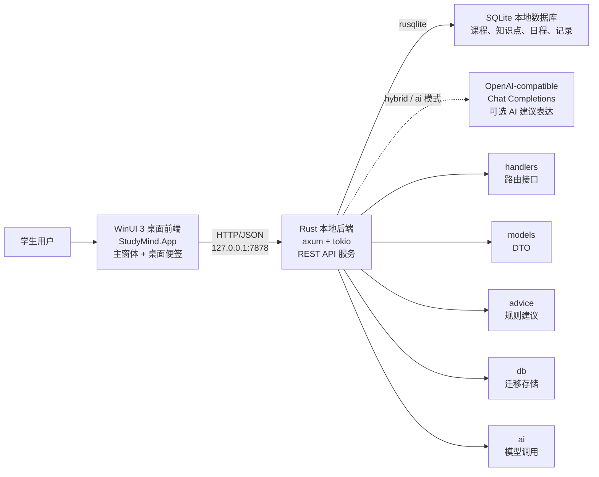

## 项目核心功能

StudyMind 围绕“计划生成、任务执行、记录学习、复盘反馈”的学习闭环设计，主要功能包括：

1. 课程与知识点管理：创建课程，维护每门课程下的知识点，设置掌握程度、重要性、预计学习时长、关联考试或 DDL 以及任务完成状态。
2. 日程管理：记录考试、作业 DDL 和活动安排，设置开始时间、结束时间、重要程度和关联课程，并参与今日推荐中的紧急度计算。
3. 学习记录管理：按日期记录某个知识点的学习分钟数、完成情况和备注，用于个人复盘，也用于后端判断近期学习投入是否不足。
4. 今日计划生成：用户输入当天状态后，系统识别情绪和压力来源，并结合课程、知识点、日程和学习记录生成今日建议与推荐任务。
5. 情绪与学习状态识别：后端通过关键词规则识别积极、中性、焦虑、疲惫、拖延等状态，并进一步判断压力类型、学习状态、建议强度和建议语气。
6. AI 建议增强：支持本地规则、混合模式和 AI 模式。后端始终先进行本地结构化分析和任务排序，再由 AI 对建议文本进行自然语言表达；当 AI 不可用时自动回退到规则建议。
7. 可视化复盘：展示学习时长趋势、情绪趋势、课程学习占比、知识点完成率、最近考试或 DDL 倒计时、今日重点和近期风险提示。
8. 数据导出与备份：支持导出课程、知识点、日程、学习记录、情绪日志和建议日志，也可以备份 SQLite 数据库文件。
9. 桌面便签：提供可置顶、可拖动的伴随小窗，用于快速生成今日计划、查看推荐任务、检查 DDL 和浏览知识点进度。

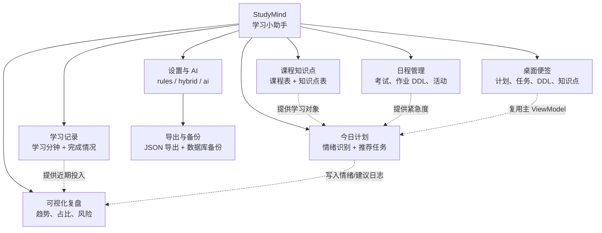

## 典型使用流程

首次使用时，学生可以先在“课程知识点”页创建课程和知识点，再在“日程”页录入考试或作业 DDL。这样系统就拥有了推荐任务所需的学习对象和紧急度信息。

在某一天开始学习前，学生进入“今日计划”页，输入类似“考试快到了，有点焦虑”的状态文本。后端会完成情绪识别、任务优先级计算和建议生成，前端展示今日建议与推荐任务。

进入执行阶段后，学生可以点击“记录学习”把推荐任务带入学习记录表单，也可以点击“完成并记录”直接写入完成记录。学习过程中，学生还可以打开桌面便签，让便签常驻在桌面上方，随时查看今日建议、推荐任务、DDL 和知识点进度。

学习一段时间后，学生进入“复盘”页查看趋势图和风险提示，了解自己的学习投入、情绪变化和任务完成情况，再据此调整后续学习安排。由此，StudyMind 形成了从计划、执行、记录到复盘的完整闭环。

## 前端介绍

前端位于 `frontend/StudyMind.App` 目录，是一个面向 Windows 桌面的 WinUI 3 客户端。它承担完整的学习规划、数据维护、复盘和设置工作流，同时提供桌面便签作为学习过程中的轻量伴随窗口。

### 前端技术栈与架构

项目文件 `StudyMind.App.csproj` 显示前端目标框架为 `net10.0-windows10.0.19041.0`，启用了 WinUI，并引用了 `CommunityToolkit.Mvvm`、`LiveChartsCore.SkiaSharpView.WinUI` 和 `Microsoft.WindowsAppSDK`。前端默认连接本地后端地址 `http://127.0.0.1:7878`，通过 HTTP/JSON 与 Rust 后端通信，JSON 字段使用 `SnakeCaseLower` 命名策略以匹配后端 DTO。

前端采用 MVVM 风格组织代码：

| 文件 | 主要职责 |
| --- | --- |
| `MainWindow.xaml` / `MainWindow.xaml.cs` | 定义主界面、侧边栏导航、页面标题工具栏、业务页面、删除确认、AI 隐私确认，以及便签窗体和托盘图标的创建、显示、隐藏和释放。 |
| `CyberNoteWindow.xaml` / `CyberNoteWindow.xaml.cs` | 定义桌面便签窗体、纸张式外观、置顶小窗、拖动区域、刷新/主窗口/隐藏按钮、方向键分页、隐藏而非关闭和位置恢复逻辑。 |
| `MainViewModel.cs` | 保存主业务状态，处理课程、知识点、日程、学习记录、今日计划、复盘、导出和备份等命令。 |
| `CyberNoteViewModel.cs` | 包装主 ViewModel，为便签提供分页状态、上一页/下一页命令、页标题、页码和页码圆点。 |
| `CyberNoteSettings.cs` | 保存便签当前页、窗口宽高和屏幕坐标，并持久化到用户目录下的 `cyber-note-settings.json`。 |
| `TrayIconController.cs` | 通过 Windows Shell NotifyIcon API 创建托盘图标，支持显示便签、隐藏便签、显示主窗口和退出程序。 |
| `StudyMindApiClient.cs` / `ApiModels.cs` | 封装 HTTP 接口调用和 JSON DTO，实现前后端数据交换。 |

桌面便签不维护独立业务数据，而是通过 `CyberNoteViewModel.Study` 引用主窗体的 `MainViewModel`。因此主窗体刷新数据、生成今日计划或写入学习记录后，便签也会通过数据绑定看到最新状态。

### 前端运行方法

使用前端前需要先启动后端服务。开发时可以用 Visual Studio 打开根目录下的 `StudyMind.sln`，将 `StudyMind.App` 设置为启动项目后运行；也可以在命令行中执行：

```powershell
dotnet restore .\StudyMind.sln
dotnet build .\frontend\StudyMind.App\StudyMind.App.csproj
```

如果当前机器缺少 Windows App SDK 或 Windows 桌面开发组件，需要通过 Visual Studio Installer 安装相应组件。

### 主界面与导航

前端主界面使用 `NavigationView` 作为应用骨架，左侧侧边栏包含“今日计划、课程知识点、日程、学习记录、复盘、设置”等页面。每个导航项在 `MainWindow.xaml` 中通过 `Tag` 标识页面，切换时由 `MainWindow.xaml.cs` 同步当前页面状态。

页面顶部保留“便签”和“刷新”入口，左侧导航栏底部或页面内会显示加载状态与操作结果。这样的布局让学生能够按照“维护数据、生成计划、记录学习、查看复盘、调整设置”的流程完成一次完整学习闭环，同时可以随时打开桌面便签进入轻量提醒模式。

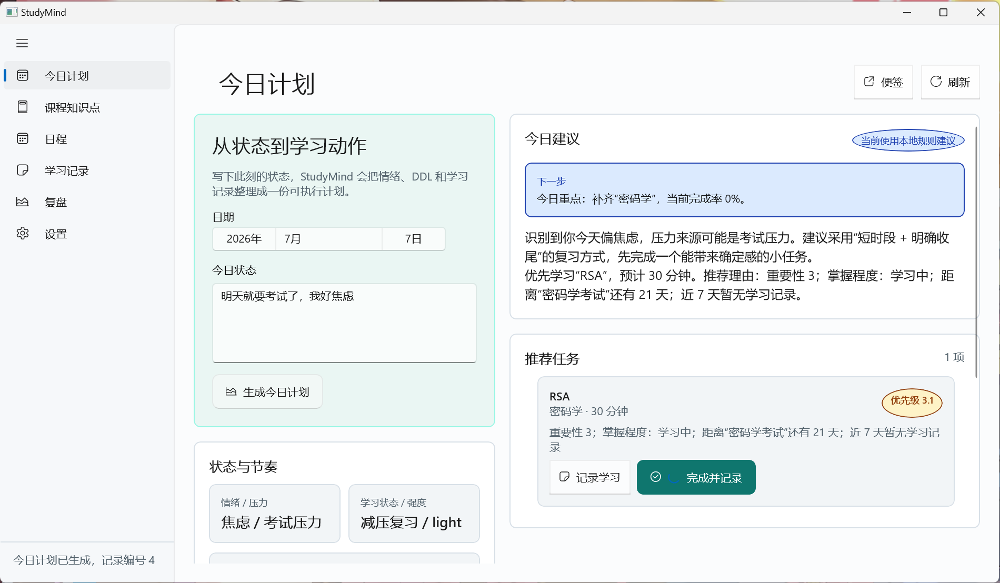

前端还实现了响应式布局。今日计划页在宽窗口下使用左右双列布局，左侧负责输入今日状态，右侧展示情绪识别、建议文本和推荐任务；在窄窗口下页面会变为单列，避免控件横向拥挤。课程、日程、学习记录、复盘和设置页面也会在窄窗口下切换为上下排列，减少内容挤压。

### 今日计划功能及使用方法

“今日计划”是系统的主要入口，也是最能体现学习助手智能性的页面。用户可以选择日期并输入当天学习状态，例如“考试快到了，有点焦虑”或“今天状态不错，想多复习一点”。点击“生成今日计划”后，前端会把日期和状态文本封装为 `TodayAdviceRequest`，再调用后端接口：

```text
POST /advice/today
```

后端返回情绪分析结果、建议正文、模型类型、推荐任务和回退原因。前端将这些结果拆分展示，使用户既能看到“系统建议我做什么”，也能看到“系统为什么这样建议”。页面主要展示情绪和压力识别结果、学习状态、建议强度、置信度、命中关键词、今日重点、临近考试或 DDL 提醒、自然语言学习建议以及推荐任务列表。

推荐任务支持两种闭环操作：“记录学习”会跳转到“学习记录”页，并自动填入知识点、日期、预计分钟数和备注；“完成并记录”会直接调用 `POST /study-records` 写入一条已完成学习记录，同时刷新复盘统计。如果当前 AI 模式不可用，页面还会显示后端返回的回退原因，说明系统已经使用本地规则建议继续工作。


### 课程知识点功能及使用方法

“课程知识点”页面用于维护系统的基础学习数据。课程是一级分类，知识点是实际被推荐、记录和统计的对象。该页面通常由表单负责录入，列表负责展示已有数据；用户选择列表项后即可进入编辑状态。

课程部分支持新建、编辑和删除课程。用户在课程名称输入框中输入名称并点击保存即可创建课程；从列表中选择已有课程后，修改名称并保存即可更新课程。删除课程前，前端会弹出确认框，说明关联知识点、学习记录和日程处理方式，降低误删风险。

知识点部分支持新建、编辑和删除知识点。用户需要选择所属课程，填写知识点名称，设置掌握程度、任务状态、重要性、预计学习分钟数，并可关联考试或 DDL。知识点状态和掌握程度会影响今日计划中的推荐排序；如果学习记录被标记为已完成，后端会同步把对应知识点状态更新为已完成并标记为已掌握。

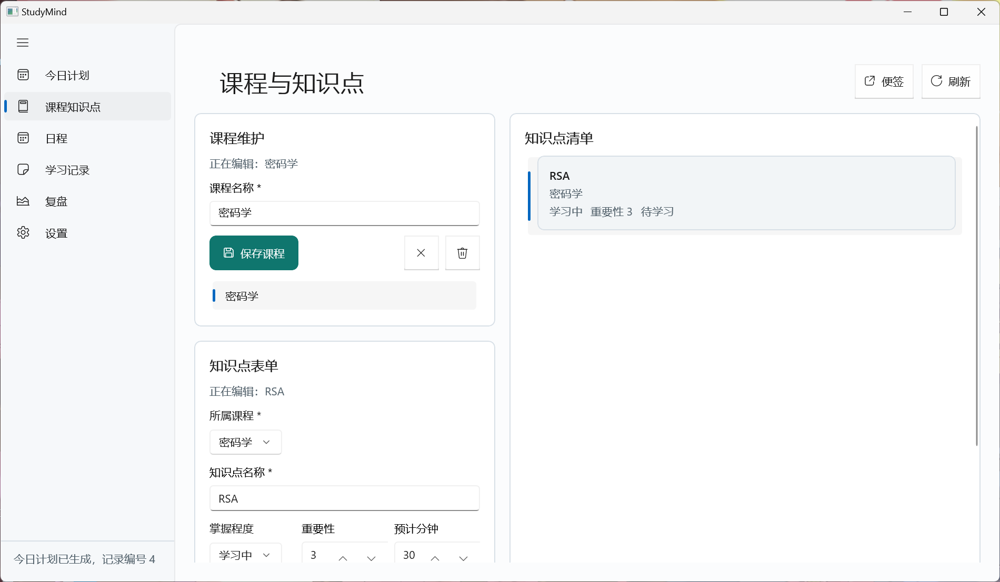

### 日程功能及使用方法

“日程”页面用于记录考试、作业 DDL 和活动安排。用户可以填写标题，选择日程类型，设置关联课程、起止日期和重要性。页面支持“仅设置结束时间点”和“日期范围”两种输入方式：考试和作业 DDL 通常只需要截止日期，活动安排则可以设置开始和结束日期。

日程数据有两方面作用：第一，它在今日计划中影响知识点紧急度，例如距离考试越近，关联知识点的推荐优先级越高；第二，它会在复盘页显示倒计时和关联未完成知识点数量，帮助学生识别近期风险。

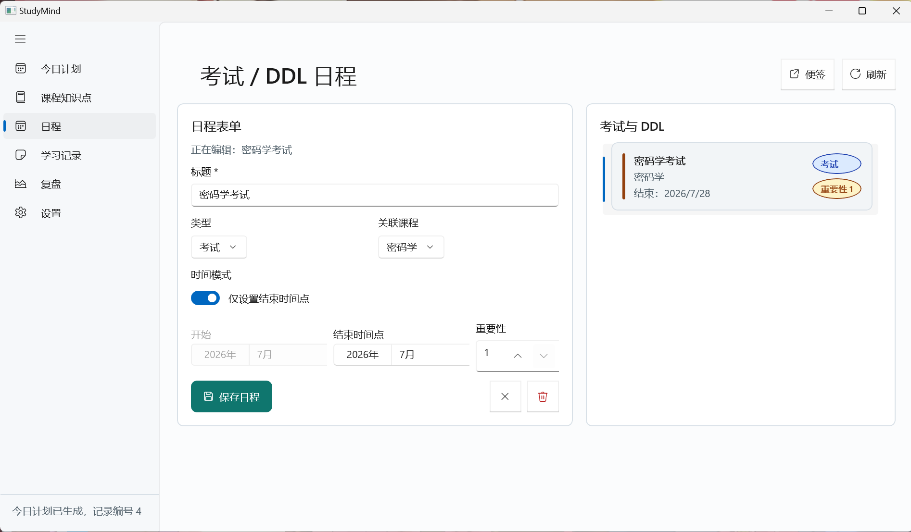

### 学习记录功能及使用方法

“学习记录”页面用于记录实际学习行为。用户需要选择知识点、学习日期、学习分钟数、完成情况和备注。保存后前端调用 `POST /study-records` 或 `PUT /study-records/{id}`。该页面既可以由用户主动填写，也可以由“今日计划”页的推荐任务自动带入，体现系统从计划到执行的闭环。

学习记录会用于统计每日学习时长、计算课程学习投入占比、判断知识点近 7 天是否学习不足、为复盘图表提供数据，并在完成记录写入后同步更新知识点掌握状态。当用户把完成情况设为已完成时，后端会同步更新对应知识点状态，使复盘页和今日计划能够感知任务进度变化。

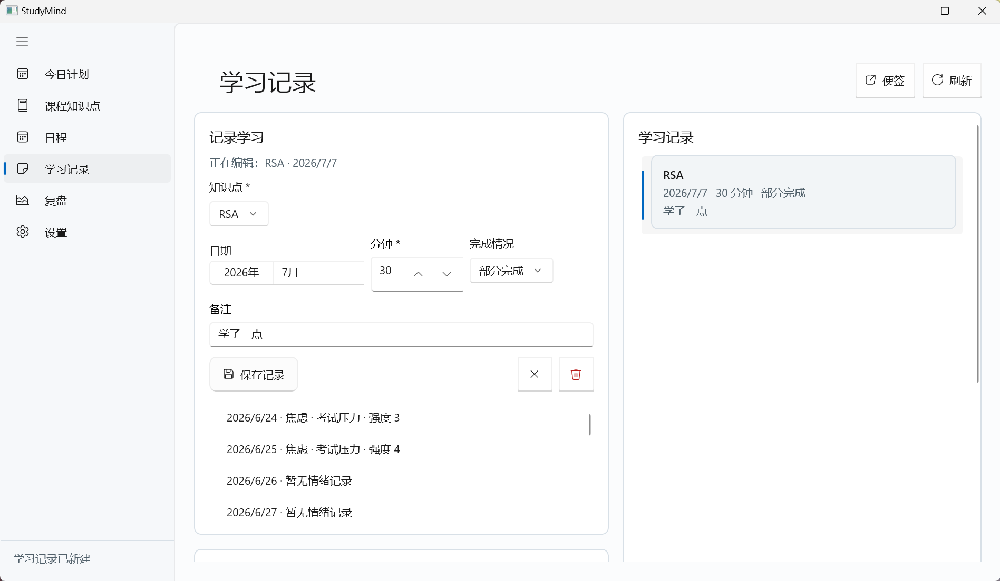

### 可视化复盘功能及使用方法

“复盘”页面用于展示最近一段时间的学习状态，是最适合展示可视化效果的部分。用户可以设置统计天数，范围为 7 到 30 天，然后点击更新复盘。前端调用：

```text
GET /stats/dashboard?date={date}&days={days}
```

接口返回每日学习分钟数、情绪趋势、课程学习投入、课程知识点完成率、临近日程、总学习时长、日均学习分钟数和整体完成率。前端使用 LiveCharts2 绘制学习时长趋势图、情绪趋势图和课程占比图，并用列表和进度展示课程完成率、临近考试或 DDL、今日重点和近期风险。数据为空时，前端不会显示空白图表，而是展示可执行的空状态提示。

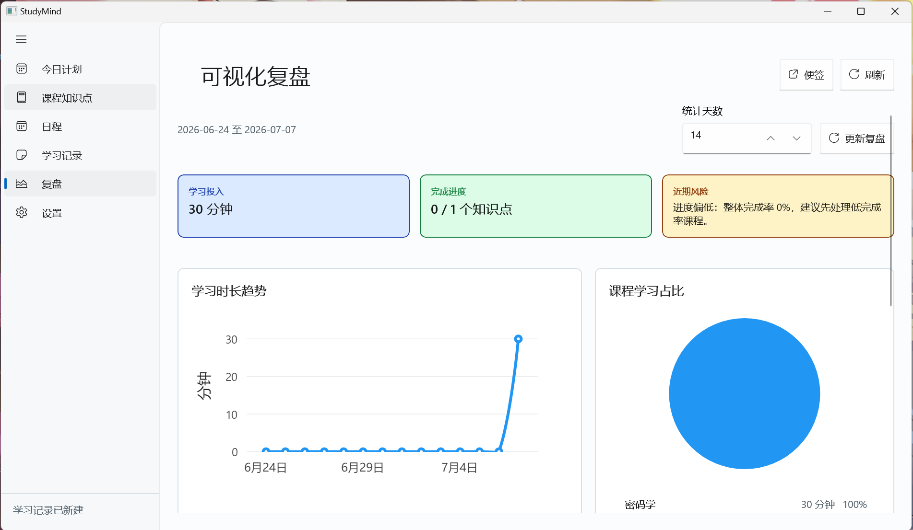

### 设置、导出与备份功能及使用方法

“设置”页面主要用于配置 AI 建议模式和本地数据管理。用户可以查看当前数据库路径，选择建议模式，填写 AI Base URL、模型名和 API Key。API Key 只写入后端设置表，不会在前端回显；当用户从本地规则模式切换到 AI 或混合模式时，前端会弹出隐私确认，提示今日状态文本和结构化学习摘要可能发送到用户配置的兼容 AI 接口。

设置页还提供“导出 JSON”和“备份数据库”功能。导出功能调用 `POST /export`，获取课程、知识点、日程、学习记录、情绪日志和建议日志，并写入本地 JSON 文件。备份功能调用 `POST /backup`，由后端执行 SQLite WAL checkpoint 后复制数据库文件，并向前端返回备份路径。

### 桌面便签窗体功能及使用方法

桌面便签对应 `CyberNoteWindow.xaml`、`CyberNoteWindow.xaml.cs`、`CyberNoteViewModel.cs`、`CyberNoteSettings.cs` 和 `TrayIconController.cs`。便签不是新的独立业务系统，而是主窗体的伴随小窗，它共享主窗体的 `MainViewModel`，从同一份课程、知识点、日程、今日建议、推荐任务和状态消息中读取数据。

便签的定位是“学习执行中的轻量提醒”。主窗体适合完整编辑和管理数据，便签适合在学习过程中置顶显示。用户可以在主窗体顶部点击“便签”按钮打开它；首次打开时，程序会懒创建 `CyberNoteWindow`，同时通过 `TrayIconController` 创建系统托盘图标。便签右上角提供刷新、回到主窗口和隐藏按钮，关闭便签窗口时默认转为隐藏，避免用户误关；只有应用真正退出时才会关闭便签并释放托盘图标。

便签内部包含四个小页面，可通过页内箭头按钮切换，也可以在非文本输入焦点下使用键盘左右方向键切换：

1. “今日计划”：选择日期并输入今日状态，复用主 ViewModel 的 `GenerateAdviceCommand` 生成学习计划。
2. “建议与任务”：展示今日建议、建议来源和推荐任务列表，包括知识点、课程、预计分钟数、推荐理由和优先级。
3. “DDL 日程”：只读展示临近考试和 DDL，包括剩余天数、类型和未完成知识点数量。
4. “知识点”：只读展示知识点队列、所属课程、预计分钟、重要性、掌握程度和完成状态。

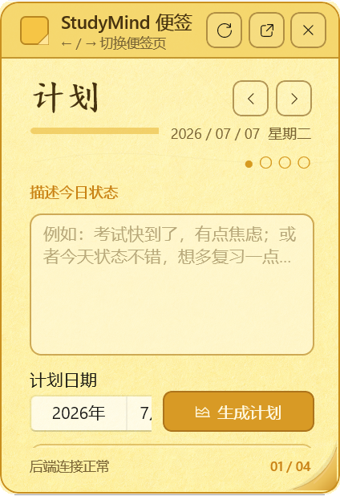

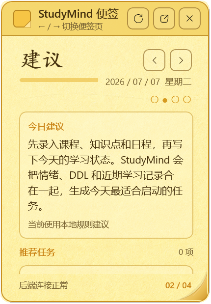

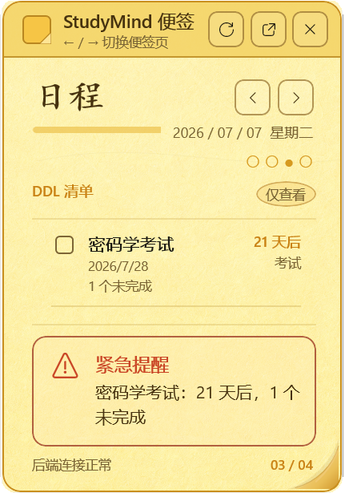

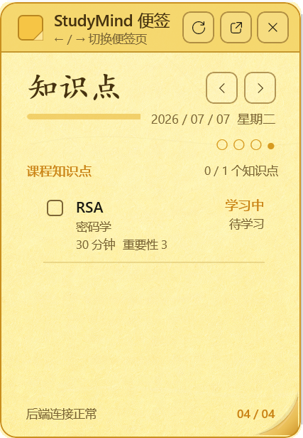

便签还会保存本地偏好，包括最后停留的小页面、窗口位置和窗口尺寸。相关设置保存在：

```text
%APPDATA%\StudyMind\cyber-note-settings.json
```

设置读取或保存失败不会影响主窗体和便签继续工作；程序会回退到默认便签大小和默认页面。便签显示时会优先恢复上次位置，如果屏幕工作区发生变化导致上次坐标不可见，程序会自动将便签移动回可见区域。

### 前端交互保护与用户体验

前端不仅实现了基本 CRUD 操作，还补充了多种交互保护：

1. 表单内错误提示：课程名称、知识点名称、日程标题、学习分钟数等字段会在前端先进行校验。
2. 删除确认：删除课程、知识点、日程和学习记录前均会弹出确认对话框。
3. 关联数据提示：删除课程或知识点时，前端会说明相关学习记录、知识点和日程会如何处理。
4. 后端未启动提示：如果连接后端失败，前端会提示运行后端启动脚本。
5. 忙碌态保护：请求执行期间按钮禁用，避免重复提交。
6. AI 隐私确认：切换到 AI 相关模式前提醒用户可能发送的数据范围。
7. 便签误关闭保护：用户关闭便签时默认转为隐藏，只有应用退出流程会真正关闭便签窗体。
8. 便签位置保护：恢复上次坐标后会检查当前屏幕工作区，若便签落在可见区域外，会自动移动回可见区域。
9. 便签偏好容错：便签设置读取或保存失败时回退默认值，不影响主窗体和便签继续运行。
10. 托盘资源清理：主窗体关闭时会同时关闭便签并删除托盘图标，避免残留无效图标。

这些设计让程序更接近真实可用的软件，而不是只完成接口调用的演示程序。

### 前后端数据对应关系

| 前端模块 | 主要接口 | 后端数据 |
| --- | --- | --- |
| 课程管理 | `/courses` | `courses` |
| 知识点管理 | `/topics` | `topics` |
| 日程管理 | `/events` | `events` |
| 学习记录 | `/study-records` | `study_records` |
| 今日计划 | `/advice/today`、`/emotion/analyze` | `emotion_logs`、`advice_logs`，并读取课程、知识点、日程和学习记录 |
| 复盘 | `/stats/dashboard` | 聚合 `study_records`、`topics`、`events`、`emotion_logs` |
| 设置 | `/settings` | `settings` |
| 导出与备份 | `/export`、`/backup` | 读取主要业务表或复制 SQLite 数据库 |
| 桌面便签 | 复用 `RefreshCommand`、`GenerateAdviceCommand` 和已加载集合 | 生成今日计划时写入 `emotion_logs`、`advice_logs`；本地分页和窗口偏好保存到 `cyber-note-settings.json` |

前端围绕学生实际使用流程组织页面，并通过桌面便签把完整规划界面延伸为轻量伴随窗口；后端围绕数据存储、规则分析、AI 增强和统计聚合提供能力。两部分通过 HTTP/JSON 解耦，使系统既便于本地演示，也便于后续扩展。例如，后续可以将关键词情绪识别替换为训练后的文本分类模型，增加云同步、多用户登录、学习提醒、番茄钟或更复杂的排程算法。
